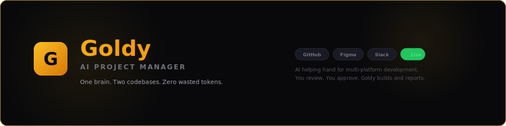

<p align="center">
  
</p>

<h1 align="center">Goldy</h1>
<h3 align="center">Your AI Hand in Product Development</h3>

<p align="center">
  <strong>One brain. Two codebases. Zero wasted tokens.</strong>
</p>

<p align="center">
  <a href="#why-goldy-exists">Why Goldy Exists</a> · <a href="#the-multi-platform-token-problem">The Token Problem</a> · <a href="#how-goldy-solves-it">How It Solves It</a> · <a href="#token-savings">Token Savings</a> · <a href="#architecture">Architecture</a> · <a href="#live-dashboard">Dashboard</a> · <a href="#setup">Setup</a>
</p>

---

## Why Goldy Exists

Goldy was born from a real problem: **building the same feature natively on iOS and Android with AI assistance burns tokens at 2x the rate — and loses cross-platform knowledge in the process.**

When you use AI agents to build a feature on two separate codebases — say, a Gold investment module on Swift (iOS) and Kotlin (Android) — each agent starts from scratch. The iOS agent understands the Figma design, makes architecture decisions, writes domain models, resolves product questions. Then the Android agent needs to learn all of that again. Different session. Different context. Different tokens.

Every design decision, every Figma interpretation, every product answer, every architecture choice — consumed twice. And worse: the two agents have no idea what the other one decided. The iOS agent picks `Clean Arch + MVVM`. The Android agent might go a completely different direction. Your iOS agent resolves 27 Figma questions with Product. Your Android agent asks the same 27 questions again — or worse, guesses differently.

That's the problem Goldy solves. **One shared knowledge base. Two codebases. Every decision made once, applied everywhere.**

## The Multi-Platform Token Problem

Here's what actually happens when you build the same feature on iOS and Android using separate AI agents:

```
Without Goldy:
┌─────────────────────────────────────────────────────────────────┐
│                                                                 │
│  iOS Agent (Session A)           Android Agent (Session B)      │
│  ─────────────────────           ──────────────────────────     │
│  • Read Figma designs ←──┐  ┌──→ • Read Figma designs          │
│  • Understand PRD    ←───┤  ├──→ • Understand PRD               │
│  • Learn codebase    ←───┤  ├──→ • Learn codebase               │
│  • Resolve 27 design ←───┤  ├──→ • Resolve same 27 design      │
│    questions             │  │      questions AGAIN              │
│  • Make architecture ←───┤  ├──→ • Make architecture            │
│    decisions             │  │      decisions INDEPENDENTLY      │
│  • Build domain      ←───┤  ├──→ • Build domain models          │
│    models                │  │      (possibly DIFFERENT)         │
│  • Write tests       ←───┘  └──→ • Write tests                  │
│                                                                 │
│  Total: ~150K tokens            Total: ~150K tokens             │
│                                                                 │
│  Combined: ~300K tokens for ONE feature                         │
│  Cross-platform knowledge: ZERO                                 │
│  Decision consistency: HOPING FOR THE BEST                      │
└─────────────────────────────────────────────────────────────────┘
```

The real cost isn't just tokens — it's **context divergence**. When two AI agents independently interpret the same Figma file, resolve the same ambiguities, and make separate architecture calls, you end up with two implementations that look like they were built by two different teams. Because they were.

```
With Goldy:
┌─────────────────────────────────────────────────────────────────┐
│                                                                 │
│                    Goldy Knowledge Base                          │
│           ┌──────────────────────────────┐                      │
│           │  CLAUDE.md (hot cache)       │                      │
│           │  memory/projects/*.md        │                      │
│           │  memory/glossary.md          │                      │
│           │  memory/context/company.md   │                      │
│           │                              │                      │
│           │  • 27 Figma decisions ✅     │                      │
│           │  • Architecture patterns ✅   │                      │
│           │  • Domain model specs ✅      │                      │
│           │  • PR review learnings ✅     │                      │
│           │  • Test strategies ✅         │                      │
│           │  • Product answers ✅         │                      │
│           └──────────┬───────────────────┘                      │
│                      │                                          │
│              ┌───────┴───────┐                                  │
│              │               │                                  │
│         iOS Agent       Android Agent                           │
│         reads memory    reads SAME memory                       │
│         builds Swift    builds Kotlin                           │
│         updates memory  updates SAME memory                     │
│              │               │                                  │
│              └───────┬───────┘                                  │
│                      │                                          │
│           Goldy synthesizes both                                │
│           into unified status report                            │
│                                                                 │
│  Total: ~95K tokens (shared context) + ~55K tokens per platform │
│  Combined: ~205K tokens — 32% savings                           │
│  Cross-platform knowledge: FULL                                 │
│  Decision consistency: GUARANTEED                               │
└─────────────────────────────────────────────────────────────────┘
```

## Token Savings — Real Numbers from Gold Module

These are actual numbers from building the Gold/Wealth module on Vance (iOS + Android):

### Context That Was Loaded Once, Used Twice

| Knowledge Area | Tokens (approx) | Without Goldy | With Goldy |
|---|---|---|---|
| Figma design interpretation (27 decisions) | ~18,000 | Loaded 2x = 36K | Loaded 1x = 18K |
| PRD / product requirements | ~8,000 | Loaded 2x = 16K | Loaded 1x = 8K |
| Domain model specifications | ~12,000 | Inferred 2x = 24K | Defined 1x = 12K |
| Architecture decisions (Clean Arch patterns) | ~6,000 | Decided 2x = 12K | Decided 1x = 6K |
| Product Q&A (Slack threads, answers) | ~10,000 | Resolved 2x = 20K | Resolved 1x = 10K |
| Test strategy & gap analysis | ~5,000 | Analyzed 2x = 10K | Analyzed 1x = 5K |
| PR review learnings (Paul's feedback) | ~4,000 | Lost = 0 benefit | Applied to both = 4K saved |
| Company context (tools, integrations) | ~3,000 | Loaded 2x = 6K | Loaded 1x = 3K |
| **Total shared context** | **~66,000** | **~124,000** | **~66,000** |

### Gold Module Stats

| Metric | iOS | Android | Total |
|---|---|---|---|
| Source files built | 64 Swift files | 19 Kotlin files | 83 files |
| Test files | 10 | 8 | 18 |
| Tests written | 117 | 25 | 142 |
| Design decisions applied | 27 | Same 27 | 27 (not 54) |
| Current completion | 40% | 28% | — |

### Token Efficiency Summary

| | Without Goldy | With Goldy | Savings |
|---|---|---|---|
| Figma → code (both platforms) | ~300K tokens | ~205K tokens | **~95K tokens (32%)** |
| Design decisions | Made twice, possibly divergent | Made once, guaranteed consistent | **~58K tokens** |
| Cross-platform knowledge | None — each agent is blind | Full — both agents share brain | **Priceless** |
| PR review learnings | Lost between sessions | Persisted and applied forward | **~15K tokens/PR cycle** |
| Onboarding new module | Re-learn everything | Memory loads in ~2K tokens | **~80K tokens/new feature** |

**Over the life of the Gold module (estimated 6 months, ~50 sessions):** Goldy saves an estimated **~200K–400K tokens** while delivering higher consistency and zero knowledge loss.

### The Hidden Cost: Context Divergence

Token savings are measurable. But the bigger value is what you *don't* lose:

Without Goldy, each AI agent session is a fresh start. The iOS agent might decide the returns calculator uses `Decimal` math. The Android agent might use `BigDecimal` — or worse, `Double`. The iOS agent resolves that "Buy Digital Gold" should route to KYC first. The Android agent routes directly to BuyGoldView. These aren't hypotheticals — they're the exact kind of divergences that happen when two agents interpret the same Figma independently.

Goldy's memory file records: *"Buy Digital Gold tap action → KYC/onboarding flow first (not BuyGoldView directly)"*. Both agents read it. Both implement it correctly. Decision made once. Applied everywhere.

## What is Goldy?

Goldy is the **intelligent hand beside your project manager** — translating the speed of your vibe into a language the entire feature team, stakeholders, and leadership can understand.

Product development is no longer a waterfall. It's not even agile anymore — it's vibes. A solo dev pushes 54 Kotlin files on Monday, gets Figma feedback on Tuesday, rewrites the MVI layer on Wednesday, and ships a PR on Thursday that touches 12 modules. The PM asks "where are we?" and the honest answer is: "everywhere and nowhere — let me check git."

Goldy checks git for you. Checks Figma. Checks Slack. And keeps a shared memory that ensures every AI agent building your product — whether it's touching Swift or Kotlin — is working from the same source of truth.

## The Bigger Picture

The teams that will thrive in this era of accelerating intelligence aren't the ones with the most process. They're the ones with the most clarity. When AI can write code, review designs, and generate tests — the bottleneck moves to **coordination, context, and communication**. That's the hard problem. That's what Goldy solves.

Think of it this way: today Goldy reads your GitHub and produces a status report while keeping your cross-platform knowledge synchronized. Tomorrow, Goldy understands your PRD, watches your Figma evolve, tracks your test coverage trend, knows which architectural decisions were made in Slack three weeks ago, and synthesizes all of it into a living document that keeps your entire team — from the intern to the CTO — on the same page.

This is the beginning of a larger, deeper product development journey. Goldy grows with your ambition.

## How Goldy Solves It

### The Shared Knowledge Architecture

Goldy maintains a single knowledge base that both platform agents read from and write to. Every Figma interpretation, every product decision, every architecture choice, every PR review learning — captured once, applied everywhere.

```
┌──────────┐     ┌──────────┐     ┌──────────┐     ┌──────────┐
│  GitHub   │     │  Figma   │     │  Slack   │     │   PRD    │
│  Commits  │     │  Designs │     │  Threads │     │  Specs   │
└─────┬─────┘     └─────┬────┘     └─────┬────┘     └─────┬────┘
      │                 │                 │                 │
      └────────┬────────┘────────┬────────┘────────┬────────┘
               │                 │                 │
         ┌─────▼─────────────────▼─────────────────▼─────┐
         │              Goldy Knowledge Base              │
         │                                                │
         │  CLAUDE.md ──── Hot cache (~80 lines)          │
         │  memory/    ──── Deep context (on-demand)      │
         │                                                │
         │  ┌─────────────────────────────────────────┐   │
         │  │ After every commit & major change:      │   │
         │  │ • Update project status                 │   │
         │  │ • Record decisions made                 │   │
         │  │ • Capture PR review learnings           │   │
         │  │ • Log completion percentages            │   │
         │  │ • Track open questions                  │   │
         │  └─────────────────────────────────────────┘   │
         └───────────────────┬───────────────────────────┘
                             │
          ┌──────────────────┼──────────────────────┐
          │                  │                      │
    ┌─────▼──────┐    ┌──────▼──────────┐    ┌─────▼──────┐
    │ iOS Agent  │    │  Goldy Status   │    │  Android   │
    │ reads +    │    │  Dashboard +    │    │  Agent     │
    │ writes     │    │  Slack Report   │    │  reads +   │
    │ memory     │    │                 │    │  writes    │
    └────────────┘    └─────────────────┘    └────────────┘
```

### What Goldy Reads

| Source | What Goldy Extracts |
|--------|-------------------|
| **GitHub** | Commit history, branch activity, file counts, test counts, days since last push, PR review status |
| **Figma** | Design specs, open questions, asset requirements, pixel-match targets |
| **Slack** | Product decisions, team answers, blockers, open discussion threads |
| **PRD / Specs** | Feature requirements, acceptance criteria, scope boundaries |
| **CLAUDE.md** | Hot cache — team, tech stack, active branches, preferences (~80 lines, every session) |
| **memory/** | Deep context — architecture decisions, glossary, project status, company tools (on-demand) |

### What Goldy Delivers

| Output | Who It's For |
|--------|-------------|
| **Visual Dashboard** | Stakeholders, PMs, leadership — a single link that tells the whole story |
| **Slack Briefing** | Feature team — daily post to your status channel with the dashboard link |
| **Shared Memory** | AI agents — both platforms read the same decisions, same patterns, same answers |
| **AI Sprint Plan** | Developers — day-by-day parallelization strategy based on real code state |
| **Quick Wins** | Developers — 4 highest-impact actions for the next 48 hours |
| **Risk Watch** | PMs, leads — early warnings before blockers become crises |
| **Goldy's Take** | Everyone — honest, personalized assessment of where things really stand |

## Architecture

### Two-Tier Memory System

Goldy uses a two-tier memory system that persists across every session and is shared across all platform agents:

**Tier 1 — Hot Cache (`CLAUDE.md`)**

Loaded automatically every session. ~80 lines of essential context: who you are, your team, active projects, tech stack, current branches, preferences. This is the minimum viable context that makes every AI agent — whether working on iOS or Android — immediately productive without burning tokens re-learning the basics.

**Tier 2 — Deep Memory (`memory/`)**

Loaded on-demand when the agent needs deeper context. Architecture details, all 27 Figma decisions, test gap analysis, company integrations, PR review history. Only pulled when needed — keeps token usage efficient.

### The Memory-Commit Loop

This is the core of Goldy's cross-platform intelligence:

```
Developer works with AI agent on iOS
    │
    ▼
Agent makes decisions (architecture, Figma interpretation, etc.)
    │
    ▼
Memory files updated with decisions + learnings
    │
    ▼
Code committed + pushed
    │
    ▼
Developer switches to Android agent
    │
    ▼
Android agent reads SAME memory files
    │
    ▼
Applies same decisions — no re-interpretation, no divergence
    │
    ▼
Memory updated with Android-specific learnings
    │
    ▼
Goldy synthesizes both into status report
```

Every commit and major change triggers a memory update. This means the knowledge base grows organically as the project evolves. What Paul (iOS reviewer) caught in PR #1465 — use `CacheableService`, separate formatters from models, prefer `Decimal` over `Double` — is now in memory, automatically applied when building the same patterns on Android.

### Human-in-the-Loop: The Approval Gate

**This is the most important section of this README.**

Goldy is a helping hand — not an autopilot. It writes code, runs tests, generates reports. But it does **not** ship anything. Every line of code Goldy produces must pass through a human before it reaches a user. This is non-negotiable and by design.

The approval gate works like this:

```
Milestone 1 (Gold Foundation)
    │
    ▼
Goldy builds iOS code ──→ PR #1465 raised
    │
    ▼
Paul (iOS Tech Lead) reviews PR ──→ Catches issues, suggests patterns ──→ Approved ✅
    │
    ▼
Review learnings captured in Goldy's memory
    │
    ▼
Goldy builds Android code ──→ (applies iOS learnings automatically) ──→ PR raised
    │
    ▼
Sergei (Android Tech Lead) reviews PR ──→ Approved ✅
    │
    ▼
QA build sent for testing
    │
    ▼
Milestone 2 (Gold Landing Page)      ← BLOCKED until Milestone 1 PRs approved + QA passed
    │
    ▼
Goldy builds iOS ──→ New PR ──→ Paul reviews ──→ ...
Goldy builds Android ──→ New PR ──→ Sergei reviews ──→ ...
```

**Why this matters:**

The tech lead sees every change through code review. They know exactly what Goldy produced, what patterns it followed, what shortcuts it took (if any), and whether it matches the team's standards. QA sees every change through a build. They test the actual user experience — not just whether the code compiles, but whether it works.

Goldy doesn't get to skip this. No matter how good the AI gets, the human gate stays. Because:

- **Tech leads need to own the codebase.** If Paul or Sergei approve a PR, they're saying "I understand this code and I'm comfortable with it shipping." Goldy can't make that call.
- **PR review teaches Goldy.** When Paul caught that `GoldPriceFormatter` should be separate from the model, that learning went into memory and was applied to every subsequent module — on both platforms. Without human review, Goldy would keep repeating the same mistakes.
- **QA catches what code review can't.** A test can pass while the UI looks broken. A flow can compile while the user journey makes no sense. QA is the reality check.
- **No milestone starts until the previous one is approved.** This prevents Goldy from building on top of code that hasn't been verified. If Module 1 has a fundamental architecture issue, you want to catch it before Module 2 inherits it.

This creates a virtuous cycle: human review improves AI memory → better AI output → cleaner PR → faster review → more learnings captured → even better output. Over time, Goldy's code gets closer to what the tech lead would write themselves — because it's literally learning from their feedback.

## Live Dashboard

Goldy generates a visual dashboard hosted on GitHub Pages:

**[View Live Dashboard →](https://tirupatibalan-aspora.github.io/goldy/)**

The dashboard includes: deadline countdown, Goldy's insight, key metrics (commit gap, test counts, coverage), platform cards (iOS vs Android side-by-side), feature matrix, open questions, sprint plan, quick wins, risk watch, and dependency tracker.

## Who is Goldy For?

Goldy serves the entire product development chain — but it's especially valuable for **teams shipping the same feature on multiple platforms**:

- **Multi-Platform Teams** — You're building iOS + Android simultaneously. Goldy ensures both AI agents work from the same knowledge base. No duplicated context. No divergent decisions. One source of truth, two native implementations.
- **Project Managers** — One link. Real numbers from real code. Both platforms. The conversation starts at strategy, not status collection.
- **Solo Developers** — You're building both platforms alone with AI help. Goldy is the glue that keeps your iOS agent and Android agent aligned without you manually copying decisions between sessions.
- **Code Reviewers** — Your review feedback isn't lost between sessions. It's captured in Goldy's memory and applied to the next PR automatically. Review once, improve both platforms.
- **Stakeholders & Leadership** — Cross-platform progress in one dashboard. No need to ask "how's iOS?" and "how's Android?" separately.

## The Goldy Philosophy

```
Intelligence is moving fast.
Your team deserves to move with it.
But the same intelligence shouldn't pay for the same knowledge twice.
```

Goldy believes:

1. **Humans ship, AI assists** — Goldy is a helping hand, not an autopilot. Every PR needs a tech lead's approval. Every build needs QA sign-off. The human gate is permanent and non-negotiable.
2. **Shared knowledge > duplicated effort** — Every design decision should be made once and applied everywhere. AI agents working on different platforms should share a brain, not start from scratch.
3. **Memory is the moat** — The longer Goldy runs on your project, the more it knows. PR review patterns, architecture preferences, product decisions, team glossary — all compounding over time. But only because humans keep feeding it quality decisions.
4. **Clarity is a competitive advantage** — The team that sees clearest, ships fastest.
5. **AI should augment, not replace** — Goldy doesn't make decisions. Goldy makes sure the right people have the right information to make great decisions. The tech lead, the PM, and QA are irreplaceable.
6. **Reports should be beautiful** — Because when stakeholders can actually read the status, they stop interrupting developers to ask for it.

## Currently Tracking

Goldy is currently serving the **Gold/Wealth Module** at **Vance (Aspora)** — a cross-border money transfer fintech app shipping on iOS and Android simultaneously.

| | iOS | Android |
|---|---|---|
| Language | Swift 6 | Kotlin |
| UI | SwiftUI | Jetpack Compose + XML |
| Architecture | Clean Arch + MVVM | Clean Arch + MVVM (MVI for Gold) |
| DI | Factory (@Injected) | Dagger Hilt |
| Testing | Swift Testing | JUnit + MockK + Turbine |
| **Completion** | **40%** | **28%** |
| Source files | 64 | 19 |
| Tests | 117 | 25 |
| PR Reviewer | **Paul** (Tech Lead) | **Sergei** (Tech Lead) |
| PR Status | #1465 Approved by Paul ✅ | Pending |

## Setup

### Prerequisites

- GitHub repository with your code (multi-platform supported)
- Slack workspace with a status channel
- Figma file with your designs (optional)
- Claude Desktop with Cowork mode (for scheduled reports)

### Quick Start

1. **Clone this repo**
   ```bash
   git clone https://github.com/tirupatibalan-aspora/goldy.git
   ```

2. **Enable GitHub Pages**
   - Go to repo Settings → Pages
   - Source: Deploy from a branch
   - Branch: `main` → `/docs`
   - Save

3. **Your dashboard is live at:**
   ```
   https://tirupatibalan-aspora.github.io/goldy/
   ```

4. **Set up the scheduled task** in Claude Desktop / Cowork:
   - Goldy runs daily at 9 AM
   - Analyzes your Git repos, Figma designs, Slack threads
   - Generates the HTML dashboard
   - Posts the link to your Slack channel

### Project Structure

```
goldy/
├── README.md              # You are here
├── docs/
│   └── index.html         # Goldy dashboard (GitHub Pages)
└── memory/                # Goldy's shared brain (the token-saver)
    ├── glossary.md        # Team terminology decoder
    ├── projects/
    │   ├── gold-module.md # Feature status + 27 design decisions
    │   ├── vance-ios.md   # iOS architecture, patterns, DI rules
    │   └── vance-android.md # Android architecture, MVI, patterns
    └── context/
        └── company.md     # Company tools, integrations, providers
```

### How the Memory Files Work

| File | Purpose | When Updated |
|---|---|---|
| `CLAUDE.md` | Hot cache — team, stack, branches, preferences | Every session start |
| `memory/projects/gold-module.md` | Feature status, design decisions, open questions | After every commit + major change |
| `memory/projects/vance-ios.md` | iOS architecture, patterns, DI rules, known issues | After PR reviews + architecture changes |
| `memory/projects/vance-android.md` | Android architecture, MVI patterns, build configs | After PR reviews + architecture changes |
| `memory/glossary.md` | Internal terms, acronyms, nicknames | When new terms emerge |
| `memory/context/company.md` | Company tools, payment providers, feature areas | When integrations change |

Both platform agents read these files at session start. When one agent makes a decision or learns something from a PR review, it updates the memory files. The next agent — on either platform — picks up those learnings automatically. This is how 27 Figma decisions get made once and applied twice.

## What Goldy Is Not

Goldy is a helping hand. It's important to be clear about what it doesn't do — because the value of Goldy comes precisely from knowing where the AI stops and the human starts.

**Goldy does not replace your tech lead.**
It writes code. Your tech lead decides if that code is good enough. Goldy can follow patterns, match Figma, write tests — but it cannot judge whether an architectural decision will scale, whether a pattern fits your team's long-term direction, or whether a shortcut today will cost you six months from now. That's what Paul and Sergei are for.

**Goldy does not ship code.**
Nothing Goldy produces reaches a user without passing through PR review and QA. Goldy raises the PR. A human approves it. QA tests the build. Only then does it move forward. There is no "auto-merge" mode. There never will be.

**Goldy does not make product decisions.**
It records them. When Product decides the "Buy Digital Gold" button should route to KYC first, Goldy writes it down and makes sure both platforms implement it consistently. But Goldy never decides what the product should do — it only ensures that what was decided gets built correctly on both sides.

**Goldy does not handle sensitive operations.**
It doesn't push to production branches, doesn't merge PRs, doesn't deploy builds, doesn't manage secrets or API keys. These are human-only operations that require judgment and accountability Goldy cannot provide.

**Goldy is not a project manager.**
It gives your PM the data — file counts, test counts, completion percentages, blockers, risks. But it doesn't set priorities, negotiate deadlines, or manage stakeholder expectations. That's still a human skill. Goldy makes the PM faster and better informed, not redundant.

**Goldy's memory is only as good as what you feed it.**
If a critical design decision happens in a hallway conversation and nobody tells Goldy, both platform agents will make their own (possibly different) assumptions. Goldy only knows what's in its memory files. Garbage in, garbage out — just like any tool.

## Roadmap

- [x] Daily HTML dashboard generation
- [x] Slack integration (daily briefing + AI recommendations thread)
- [x] GitHub commit analysis (file counts, test counts, commit gap detection)
- [x] Figma design question tracking and decision logging
- [x] AI sprint recommendations with parallelization strategy
- [x] Two-tier memory system for cross-session intelligence
- [x] Scheduled daily reports (9 AM)
- [x] GitHub Pages hosting for shareable dashboard
- [x] Cross-platform shared knowledge base (iOS ↔ Android memory sync)
- [x] PR review learning capture (Paul's feedback → memory → both platforms)
- [x] Human-in-the-loop approval gates (no module starts until previous PR approved)
- [ ] GitHub Pages auto-deploy on report generation
- [ ] PR review status tracking and reviewer nudges
- [ ] Test coverage trend charts (week-over-week)
- [ ] Burndown visualization against deadline
- [ ] Multi-project support (track multiple features simultaneously)
- [ ] Team velocity tracking across sprints
- [ ] PRD ingestion and requirement tracking
- [ ] Figma-to-code progress mapping
- [ ] Jira / Linear / Notion integration
- [ ] Auto-generated release notes from commit history
- [ ] Stakeholder-specific views (PM view vs Developer view vs Leadership view)
- [ ] Risk prediction based on historical patterns
- [ ] Token usage analytics dashboard

---

<p align="center">
  <strong>Goldy</strong> — Your AI Hand in Product Development<br>
  <em>One brain. Two codebases. Zero wasted tokens.</em><br><br>
  Built by <a href="https://github.com/tirupatibalan-aspora">Tirupati Balan</a> at <a href="https://aspora.com">Aspora</a>
</p>
